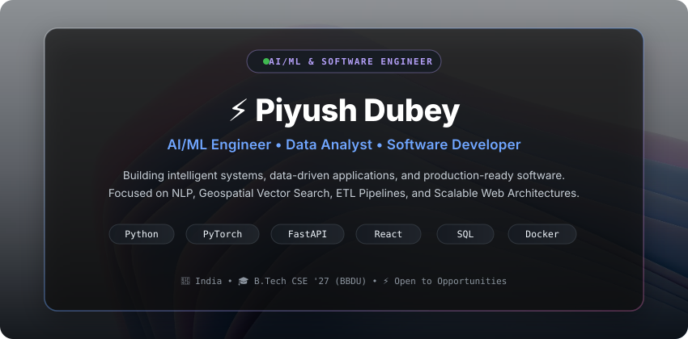

 
 

  
  &nbsp;
  
  &nbsp;
  
  &nbsp;
  

---

### 👨‍💻 Profile Overview

- 🎓 **Education**: B.Tech in Computer Science & Engineering @ **Babu Banarasi Das University** (2023–2027)
- 📍 **Location**: India (Open to Relocation & Remote Opportunities)
- 🧠 **Primary Focus**: AI/ML Systems, Natural Language Processing (NLP), Vector Search, and High-Throughput APIs
- 📊 **Analytics**: End-to-end ETL pipelines, Data Modeling, Complex SQL Analytics, and Power BI dashboards
- 💻 **Software Engineering**: Full-Stack MERN platforms, asynchronous FastAPI microservices, and distributed architecture
- 🎯 **Current Objective**: Software Engineer / AI Engineering Roles

---

### 🚀 Featured Engineering Projects

<table>
  <thead>
    <tr>
      <th align="left">Repository / Project</th>
      <th align="left">Tech Stack</th>
      <th align="left">Engineering Highlights</th>
      <th align="center">Links</th>
    </tr>
  </thead>
  <tbody>
    <tr>
      <td><strong>🛰️ <a href="https://github.com/piyushdubey26/SatQuery-X">SatQuery-X</a></strong></td>
      <td><code>Python</code> <code>FastAPI</code> <code>PyTorch</code> <code>ChromaDB</code> <code>React</code></td>
      <td>AI/ML-powered intelligent query engine for multi-modal geospatial telemetry and vector similarity search.</td>
      <td align="center"><a href="https://github.com/piyushdubey26/SatQuery-X"><b>Code</b></a></td>
    </tr>
    <tr>
      <td><strong>📄 <a href="https://github.com/piyushdubey26/Automated-Resume-Screening">Automated Resume Screening</a></strong></td>
      <td><code>Python</code> <code>NLP</code> <code>spaCy</code> <code>Scikit-learn</code> <code>Streamlit</code></td>
      <td>NLP-based ATS resume parser with entity extraction, semantic skill matching, and candidate scorecards.</td>
      <td align="center"><a href="https://github.com/piyushdubey26/Automated-Resume-Screening"><b>Code</b></a></td>
    </tr>
    <tr>
      <td><strong>📊 <a href="https://github.com/piyushdubey26/Data-Analytics-Platform">Data Analytics Platform</a></strong></td>
      <td><code>Python</code> <code>Pandas</code> <code>NumPy</code> <code>SQL</code> <code>Power BI</code></td>
      <td>Interactive analytics workflow transforming raw multi-source data into actionable BI dashboards with automated ETL.</td>
      <td align="center"><a href="https://github.com/piyushdubey26/Data-Analytics-Platform"><b>Code</b></a></td>
    </tr>
    <tr>
      <td><strong>🛒 <a href="https://github.com/piyushdubey26/ShopSphere-Ecommerce">ShopSphere E-Commerce</a></strong></td>
      <td><code>React</code> <code>Node.js</code> <code>Express</code> <code>MongoDB</code> <code>Stripe</code></td>
      <td>Enterprise full-stack MERN store featuring real-time inventory, JWT auth, Stripe payments, and admin KPI metrics.</td>
      <td align="center"><a href="https://github.com/piyushdubey26/ShopSphere-Ecommerce"><b>Code</b></a></td>
    </tr>
    <tr>
      <td><strong>🏏 <a href="https://github.com/piyushdubey26/Enterprise-IPL-Analytics">Enterprise IPL Analytics</a></strong></td>
      <td><code>Python</code> <code>Pandas</code> <code>Scikit-learn</code> <code>EDA</code></td>
      <td>Statistical cricket analytics platform evaluating ball-by-ball match metrics, player strike rates, and predictive models.</td>
      <td align="center"><a href="https://github.com/piyushdubey26/Enterprise-IPL-Analytics"><b>Code</b></a></td>
    </tr>
    <tr>
      <td><strong>🌐 <a href="https://github.com/piyushdubey26/portfolio">Developer Portfolio</a></strong></td>
      <td><code>Next.js 14</code> <code>Three.js</code> <code>TypeScript</code> <code>Tailwind</code></td>
      <td>Futuristic 3D WebGL developer portfolio featuring interactive orbital scenes and smooth transitions.</td>
      <td align="center"><a href="https://github.com/piyushdubey26/portfolio"><b>Code</b></a></td>
    </tr>
  </tbody>
</table>

---

### 💻 Technical Stack & Competencies

<table>
  <tr>
    <td align="left" width="22%"><strong>Languages</strong></td>
    <td>
      
      
      
      
      
      
    </td>
  </tr>
  <tr>
    <td align="left"><strong>AI & Machine Learning</strong></td>
    <td>
      
      
      
      
      
      
    </td>
  </tr>
  <tr>
    <td align="left"><strong>Data & Analytics</strong></td>
    <td>
      
      
      
      
      
      
    </td>
  </tr>
  <tr>
    <td align="left"><strong>Backend & Systems</strong></td>
    <td>
      
      
      
      
      
      
    </td>
  </tr>
  <tr>
    <td align="left"><strong>Frontend & UI</strong></td>
    <td>
      
      
      
      
      
    </td>
  </tr>
  <tr>
    <td align="left"><strong>DevOps & Tools</strong></td>
    <td>
      
      
      
      
      
      
    </td>
  </tr>
  <tr>
    <td align="left"><strong>Cloud & Hosting</strong></td>
    <td>
      
      
      
      
    </td>
  </tr>
</table>

---

### 📊 GitHub Activity & Real-Time Stats

  
  &nbsp;
  

  

  

  

---

### 📅 Current Focus & Learning (2026)

- 🚀 **AI / ML Systems**: Scaling SatQuery-X with vector search & multi-modal retrieval
- 📊 **Data Intelligence**: Building automated end-to-end data pipelines & Power BI executive analytics
- 🌐 **Full-Stack Engineering**: Production deployments with FastAPI, Next.js, and Docker
- 📚 **Placement Preparation**: Structured DSA, System Design, and CS Fundamentals (TCS Prime 2026)

---

  
⭐ Designed & Engineered with precision by <strong>Piyush Dubey</strong>

