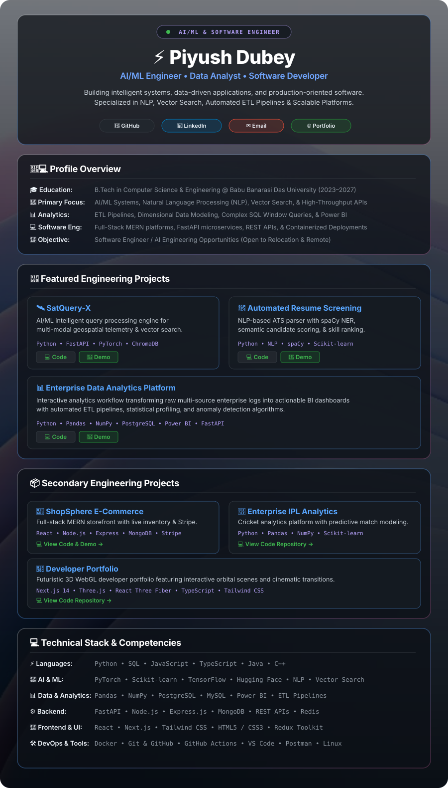

<!-- FULL-PAGE WAVE BACKGROUND HERO & PROFILE COMPOSITION -->

 

<!-- QUICK ACTION SOCIAL BUTTONS -->

  
  &nbsp;
  
  &nbsp;
  
  &nbsp;
  
  &nbsp;
  

---

### 📊 GitHub Activity & Statistics

  
  &nbsp;
  

  

  

  

---

  
Let's build something useful. 🚀

